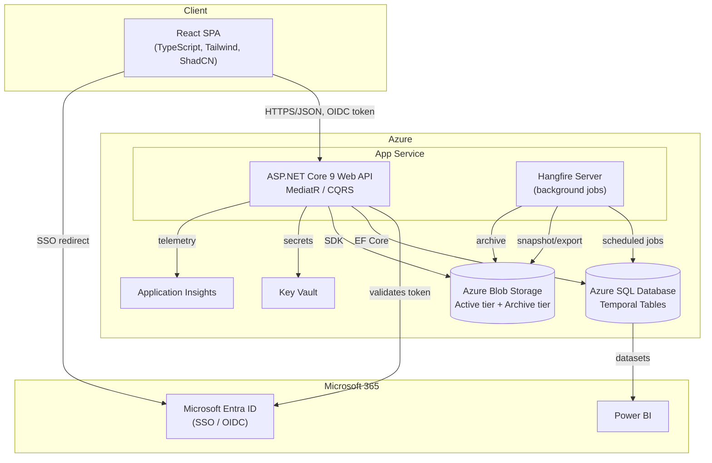

# Enterprise Solution Architecture

## 1. Purpose & Scope

The Stirling Council Capital Projects Management Platform ("SC-PM") is the single source of truth for the council's capital programme, managing projects from RIBA Stage 0 through Stage 7. It replaces spreadsheet-based governance and reporting with a governed, auditable, temporal system of record that integrates with Microsoft 365.

Non-functional targets:

- Scale: 500+ concurrent projects, £500m+ programme value, 10+ years of temporal history retained.
- Availability: 99.9% during business hours (Azure App Service + SQL zone-redundant).
- Auditability: every create/update/delete/approve/reject/export/login is logged; no physical deletes on governance-critical entities.
- Security: Entra ID SSO, RBAC enforced at API and query (row-level) layers.

## 2. Architectural Style

- **Clean Architecture / Onion** on the backend: `Domain` has zero dependencies; `Application` depends only on `Domain` and defines infrastructure interfaces; `Infrastructure` implements those interfaces (EF Core, Blob Storage, Hangfire, report generators); `Api` is the composition root and HTTP boundary.
- **CQRS via MediatR**: every use case is a `Command` or `Query` handled by a single handler. `FluentValidation` validators run as a MediatR pipeline behaviour before the handler executes. This keeps controllers thin and makes every action independently testable and auditable.
- **Vertical slices per module**: Governance, Cost, Programme, Risk, Stakeholder, Documents, NEC4, SBCC, Reporting, Handover and Audit are each a folder of commands/queries/handlers/validators/DTOs under `Application`, not a shared "service layer" — this keeps modules independently extensible as the programme grows.
- **Event-sourced-adjacent audit**: rather than full event sourcing, the platform uses SQL Server **temporal tables** for entity-level history plus an explicit **Audit** schema (`ActivityLog`, `FieldAudit`) for who/why. This gives point-in-time reconstruction (`FOR SYSTEM_TIME AS OF`) without the operational complexity of a full event store, which is the right trade-off for a reporting- and compliance-heavy domain rather than a high-write-throughput one.
- **SPA + API**: React SPA talks to the ASP.NET Core Web API over HTTPS/JSON; no server-rendered pages. TanStack Query owns server-state caching so the UI reflects the temporal/audit-heavy backend without hand-rolled cache invalidation.

## 3. High-Level Architecture



## 4. Solution Structure (.NET)

```
SCPM.Domain          Entities, value objects, domain events, enums. No NuGet deps beyond BCL.
SCPM.Application      MediatR commands/queries + handlers, FluentValidation validators,
                       DTOs/mapping, IRepository / IUnitOfWork / IDocumentStore interfaces.
SCPM.Infrastructure   EF Core DbContext + configurations, repository implementations,
                       Azure Blob client (active-tier document store + archive tier),
                       QuestPDF / OpenXML / ClosedXML report generators, Hangfire jobs,
                       Entra ID token validation setup.
SCPM.Api              Controllers (thin — MediatR.Send only), auth policies, middleware
                       (exception handling, audit context, correlation IDs), Swagger, DI wiring.
```

Dependency direction: `Api → Application → Domain`, `Infrastructure → Application → Domain`. `Api` composes `Infrastructure` only at startup (DI registration) — no controller references an Infrastructure type directly.

## 5. Frontend Architecture

```
src/
  app/            Router, query client, auth provider, theme provider
  components/     ShadCN-based primitives + shared composed components (StatTile, StageBadge, ...)
  features/       One folder per module (projects, governance, cost, nec4, sbcc, reporting, ...):
                  api hooks (TanStack Query), types, feature-local components
  pages/          Route-level pages composing features (Dashboard, ProjectWorkspace, ...)
  lib/            api client (fetch wrapper with auth), utils, formatters
  hooks/          Cross-cutting hooks
  styles/         Tailwind config, design tokens (Stirling palette)
```

State: server state lives in TanStack Query (cache keyed by entity + temporal "as of" where relevant); local/UI state via React state/context. No global client-state library — the domain is server-of-record, not client-authoritative.

## 6. Data Architecture

See [`docs/erd.md`](erd.md) for the entity-relationship model. Key principles:

- One SQL schema per bounded context: `Security`, `Projects`, `Governance`, `Cost`, `Programme`, `Risk`, `Stakeholder`, `Documents`, `NEC4`, `SBCC`, `Reporting`, `Handover`, `Audit`.
- **EF Core migrations are the single source of truth for every table, column, constraint, index, and temporal table** — generated from `SCPM.Domain` entities and `SCPM.Infrastructure/Persistence/Configurations`. There is no separate hand-maintained DDL; see `database/schema/README.md`. Views and stored procedures are the one exception, kept as hand-written SQL applied after migrations because EF Core has no declarative way to express them.
- All primary keys are `UNIQUEIDENTIFIER` (GUID), generated application-side (sequential GUIDs via `NEWSEQUENTIALID()` default) to avoid clustered-index fragmentation while keeping keys portable across environments (dev seed data, Blob path correlation, etc.).
- Governance-critical tables (`Projects.Project`, `Cost.CostPlan`, `Cost.Forecast`, `Programme.Programme`, `Programme.Milestone`, `Risk.Risk`, `Risk.Issue`, `Stakeholder.Stakeholder`, `Documents.Document`, `NEC4.*`, `SBCC.*`, `Governance.Approval`, `Governance.Gateway`) are **system-versioned temporal tables**, enabling `FOR SYSTEM_TIME ALL / AS OF / BETWEEN` queries for point-in-time reconstruction and the Snapshot Comparison Engine.
- Soft delete (`IsDeleted`, `DeletedDate`, `DeletedBy`) on all governance-critical entities; a global EF Core query filter excludes soft-deleted rows by default, with an explicit `IgnoreQueryFilters()` escape hatch for admin/audit views.
- Reporting is served from **views** over the temporal tables (never directly from base tables in report queries) so report logic is centralised and testable via SQL, and stays decoupled from OLTP shape changes.
- Cross-cutting write logic (audit stamping, temporal-safe upserts) is centralised in **stored procedures** where it must be transactionally atomic with multiple tables (e.g. stage-gate approval writing to `Governance.Approval`, `Governance.Gateway`, and `Audit.ActivityLog` in one transaction).

## 7. Security Model

- **AuthN**: Microsoft Entra ID, OIDC authorization code flow (SPA via MSAL.js), JWT bearer validation on the API.
- **AuthZ**: RBAC with 10 roles (Administrator, Director, Project Sponsor, Programme Manager, Project Manager, Commercial Manager, Quantity Surveyor, Governance Officer, Committee Officer, Read Only User). Roles map to Entra ID app roles/groups; the API enforces policy-based authorization per endpoint and, where needed, row-level filtering (e.g. a Project Manager sees only their assigned projects unless also Director/Administrator).
- **Transport/secrets**: TLS everywhere, secrets in Key Vault, managed identities for App Service → SQL/Blob/Key Vault (no connection-string secrets in config).
- **Audit**: every mutating action captured in `Audit.ActivityLog`; every field change on tracked entities captured in `Audit.FieldAudit` via an EF Core `SaveChanges` interceptor — this is infrastructure-level, not opt-in per handler, so it cannot be forgotten by a future module.

## 8. Background Processing

Hangfire, hosted in-process on the App Service (dashboard secured behind Administrator role), drives:

- Scheduled snapshots (daily/weekly/monthly)
- Event snapshots (gateway approval, committee submission, contract award) — triggered from the relevant command handler via `IBackgroundJobClient.Enqueue`, not polled
- Scheduled report generation and export-pack assembly
- Archive-tier moves once a document version is superseded/rejected and archived

## 9. Reporting & Export

A single `IReportExporter<TModel>` abstraction per report type produces PDF (QuestPDF), DOCX/PPTX (OpenXML SDK), and XLSX (ClosedXML) from the same view-model, so branding (Stirling palette, typography, header/footer) is defined once and applied identically across formats. Power BI consumes SQL views directly (import or DirectQuery per dataset) rather than duplicating report logic.

## 10. Why These Trade-offs

- **Temporal tables over full event sourcing**: the domain needs point-in-time and audit reconstruction, not replayable business logic — temporal tables deliver that with native SQL Server tooling and no bespoke projection infrastructure.
- **CQRS/MediatR without a message bus**: the platform is a single bounded deployment unit (one API, one database) at this stage; MediatR gives the CQRS separation and pipeline behaviours (validation, logging, audit) without the operational cost of a distributed message bus that isn't yet justified by scale.
- **Azure Blob Storage for both the active and archive document tiers**: originally the active tier was SharePoint Online, to keep documents inside the council's existing M365 governance/compliance boundary — but Graph's app-only access needs a tenant admin to grant application-permission consent, which was not obtainable, so both tiers now live in Blob Storage (two containers, one storage account), with Blob's access tiers (Hot for active, Cool/Archive for archived) giving the same cost/performance split SharePoint+Blob previously did. If admin consent later becomes available, `IDocumentStore` is the one seam to swap back.
