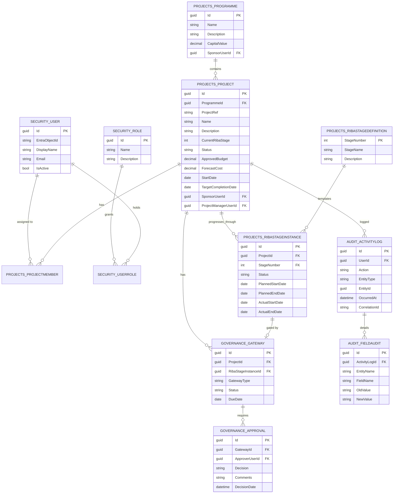

# Entity-Relationship Model

This document covers the full target data model and marks which parts are implemented in Phase 1 (`database/schema/`). Later phases implement the remaining schemas following the same conventions (GUID PK, temporal, soft delete, audit).

## Conventions

- Every table: `Id UNIQUEIDENTIFIER PRIMARY KEY DEFAULT NEWSEQUENTIALID()`.
- Governance-critical tables: `IsDeleted BIT`, `DeletedDate DATETIME2 NULL`, `DeletedBy UNIQUEIDENTIFIER NULL`, plus `SysStartTime`/`SysEndTime` system-versioning columns (temporal).
- Every table: `CreatedBy`, `CreatedDate`, `ModifiedBy`, `ModifiedDate`.
- Foreign keys named `FK_<Child>_<Parent>`; all FKs indexed.

## Phase 1 — Core Schemas (implemented)



## Phase 2 — Implemented

- **Cost**: `CostPlan` (temporal, versioned, `IsBaseline` flag) → `CostPlanLine` (category/amount); `Forecast` (temporal — a point-in-time forecast against `ApprovedBudgetAtForecast`, so variance is reconstructable even after the project's budget later changes).
- **Programme**: `Milestone` (temporal — `BaselineDate`/`ForecastDate`/`ActualDate`, `DelayDays` computed from these, distinct from `Projects.Programme` portfolio grouping — see naming note below). `ProgrammeBaseline`/`DelayEvent` as separate entities remain deferred — delay is currently a computed property on `Milestone`, not yet its own history.
- **Governance** (extends Phase 1): `DecisionRegisterEntry` (temporal) — day-to-day governance decisions, distinct from a `Gateway`/`Approval` (which gates RIBA stage progression).
- **Reporting**: `Snapshot` — a curated, named point-in-time capture of a project's key figures (RIBA stage, budget, forecast), captured manually or by the Daily/Weekly/Monthly Hangfire recurring jobs. Not temporal itself (it's already an immutable point-in-time record). `ReportDefinition`, `ReportRun`, `SnapshotComparison` remain deferred to Phase 6.

## Phase 3 — Implemented

- **Risk**: `Risk` (temporal — `Probability`/`Impact` 1-5, `Score` computed as their product, DB `CHECK` constraints enforce the 1-5 range), `Issue` (temporal — severity/status/resolution), `Opportunity` (temporal — potential value + probability, same 1-5 scale as Risk for combined reporting), `Escalation` (temporal — raises a Risk *or* Issue, exactly one via a `CHECK` constraint; distinct from `Governance.Gateway`, which gates RIBA stage progression rather than day-to-day risk/issue decisions).
- **Stakeholder**: `Stakeholder` (temporal — influence/interest), `StakeholderEngagement` (not temporal — an append-only log of touchpoints, there is nothing to version).
- `RiskScore` (probability/impact history over time, separate from the live `Risk.Score`) and `CommunicationPlanItem`/`ConsultationResponse` (forward-looking engagement planning, distinct from the engagement *log* already implemented) remain deferred — see `docs/roadmap.md`.

## Phase 4 — Implemented

- **NEC4**: `EarlyWarning` (temporal — Open/Closed), `CompensationEvent` (temporal — `Reference` unique per project, `ClauseReference` free text since the full NEC4 clause taxonomy varies by contract option, Notified → Quoted → Accepted/Rejected → Implemented), `ContractDataEntry` (temporal — one row per Part One/Two clause), `RiskAllocationItem` (temporal — Client/Contractor/Shared), `AcceptedProgrammeEntry` (temporal — the clause 31/32 acceptance log; the programme itself is tracked via `Programme.Milestone`, this is the acceptance record), `PaymentAssessment` (temporal — Assessed → Certified → Paid), `ChangeRegisterItem` (temporal — the overall change rollup, kept separate from `CompensationEvent` since not every change originates as a CE).
- **SBCC**: `Variation` (temporal — Instructed → Priced → Agreed), `ExtensionOfTime` (temporal — days claimed vs. awarded), `LossAndExpenseClaim` (temporal), `ArchitectsInstruction` (temporal — sequential `InstructionNumber` unique per project), `InterimValuation` (temporal — sequential `ValuationNumber`, gross valuation + net payment).
- Export packs (PDF/DOCX/XLSX per register) remain deferred to Phase 6, alongside the rest of the template/export engine — see `docs/roadmap.md`.

## Phase 5+ — Remaining Schemas (design-level, not yet implemented)

- **Cost**: `Budget`, `BudgetApproval`, `ForecastLine`, `FundingSource`, `FundingAllocation`.
- **Documents**: `Document` (logical record) → `DocumentVersion` (1.0 Draft, 1.1 Draft, 2.0 Approved, ...) → `File` (physical export, SharePoint/Blob pointer). Status enum: Draft, Review, Approved, Superseded, Archived, Rejected.
- **Handover**: `AssetRegisterItem`, `OMTrackerItem`, `TrainingLogItem`, `LessonLearned`, `BenefitRealisation`.

> **Naming note**: the spec uses "Programme" for both the portfolio-level grouping of projects (a capital programme, e.g. "Schools Estate Programme") and the project-level delivery schedule (a Gantt/milestone programme). These are modelled as two distinct entities — `Projects.Programme` (portfolio) and `Programme.Programme` (schedule) — to avoid ambiguity; the schema name disambiguates them.

## Temporal Table Pattern (applied to every table listed above as "temporal")

```sql
CREATE TABLE Projects.Project (
    ...,
    SysStartTime DATETIME2 GENERATED ALWAYS AS ROW START NOT NULL,
    SysEndTime   DATETIME2 GENERATED ALWAYS AS ROW END NOT NULL,
    PERIOD FOR SYSTEM_TIME (SysStartTime, SysEndTime)
)
WITH (SYSTEM_VERSIONING = ON (HISTORY_TABLE = Projects.Project_History));
```

Query patterns supported throughout:

```sql
SELECT * FROM Projects.Project FOR SYSTEM_TIME ALL WHERE Id = @Id;
SELECT * FROM Projects.Project FOR SYSTEM_TIME AS OF @AsOfDate WHERE Id = @Id;
SELECT * FROM Projects.Project FOR SYSTEM_TIME BETWEEN @Start AND @End WHERE Id = @Id;
```
